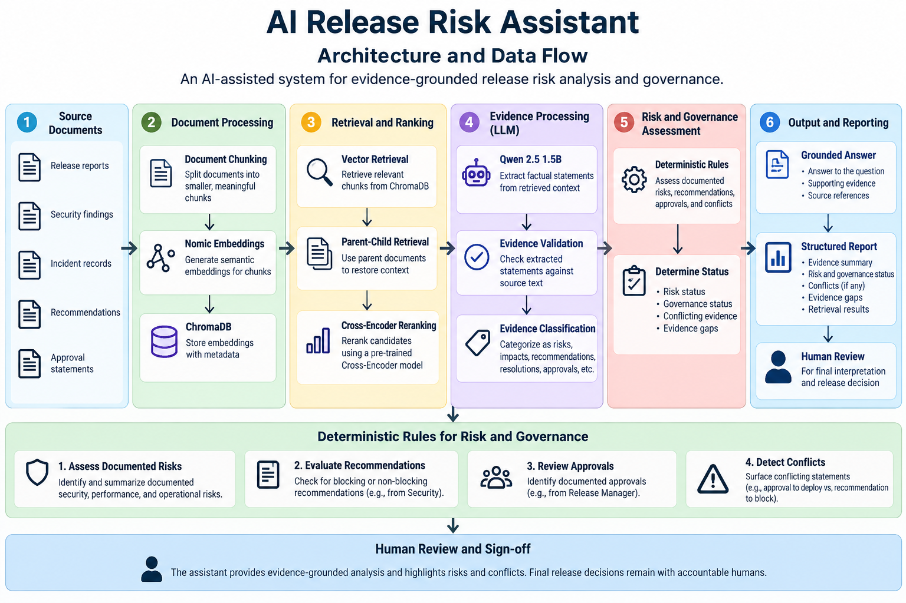

# AI Release Risk Assistant

**An evidence-grounded AI engineering prototype for software release risk analysis and governance.**

[](https://www.python.org/)
[](https://www.trychroma.com/)
[](https://ollama.com/)

## Overview

The AI Release Risk Assistant explores how Generative AI and retrieval techniques can help Quality Engineering teams analyze release documentation, retrieve supporting evidence, identify documented risks, and surface potential governance conflicts.

The prototype combines AI-assisted evidence processing with deterministic rules for risk and governance assessment. It is designed to support human decision-making, not replace accountable release approval.

**Project status:** Engineering prototype for learning, experimentation, and demonstration. Not a production release-approval system.

## The Problem

Release decisions may depend on information distributed across production reports, security findings, incident records, recommendations, and approval statements.

The assistant lets users ask questions such as:

- What security risks are present in Release 530?
- What did Security recommend?
- Who approved the deployment?
- What caused the payment failures in Release 527?
- Have previous releases had authentication vulnerabilities?

The goal is to make relevant documented evidence easier to find and assess.

## Architecture



The processing flow:

1. Load and chunk release documents.
2. Generate semantic embeddings.
3. Retrieve relevant evidence from ChromaDB.
4. Restore context using parent-child retrieval.
5. Rerank candidate documents using a Cross-Encoder.
6. Extract factual statements with Qwen through Ollama.
7. Validate and classify the extracted evidence.
8. Apply deterministic risk and governance rules.
9. Produce a grounded answer and structured report.
10. Keep human review and sign-off in the decision process.

## Technology Stack

| Component | Technology | Purpose |
|---|---|---|
| Language | Python | Orchestration and business rules |
| LLM runtime | Ollama | Local model execution |
| Language model | Qwen 2.5 1.5B | Evidence extraction |
| Embedding model | Nomic Embed Text | Semantic embeddings |
| Vector database | ChromaDB | Persistent vector storage and retrieval |
| Reranking | Sentence Transformers Cross-Encoder | Candidate reranking |
| Lexical retrieval experiments | rank-bm25 | BM25 retrieval |
| Evaluation | Golden dataset and retrieval metrics | Compare retrieval approaches |

## Setup

### Prerequisites

- Python installed and available through `python` in PowerShell.
- Git.
- Ollama installed and running.
- The required Ollama models downloaded.

The project has been developed and tested in a local Windows environment. Other environments may require adjustments.

### 1. Clone the repository

```powershell
git clone https://github.com/nerdvittal/AI-Release-Risk-Assistant.git
cd AI-Release-Risk-Assistant
```

### 2. Install Python dependencies

```powershell
python -m pip install -r requirements.txt
```

### 3. Download the Ollama models

```powershell
ollama pull qwen2.5:1.5b
ollama pull nomic-embed-text
```

Confirm that the models are available:

```powershell
ollama list
```

### 4. Confirm Ollama is responding

Open this URL in a browser:

```text
http://localhost:11434
```

The local Ollama service should respond when it is running.

### 5. Run the application

From the project root:

```powershell
python .\src\release_risk_analysis.py
```

**Note:** The application also uses local ChromaDB data and indexed release documents. A fresh clone may require the project's indexing and ingestion steps before the question-answering application can run successfully. Those steps must be verified against the current implementation before this repository is considered fully reproducible.

## Example Scenario

Release 530 contains the following documented information:

- A critical authentication vulnerability was identified.
- Security recommended blocking deployment.
- The Release Manager approved deployment.

Ask:

```text
Who approved the deployment in Release 530?
```

Illustrative answer:

```text
The Release Manager approved deployment.
```

The broader assessment should also preserve the security finding and recommendation. A documented approval does not erase a documented security concern.

The assistant's purpose is to surface evidence and governance conflicts for review—not to let an LLM make the final release decision.

## Evaluation

The project includes a retrieval evaluation dataset at `data/golden_dataset.json`.

Initial experimental results:

| Retrieval approach | Precision@3 | Recall@3 | MRR |
|---|---:|---:|---:|
| Chroma baseline | 0.33 | 0.80 | 0.40 |
| Hybrid retrieval | 0.33 | 0.80 | 0.40 |
| Hybrid + Cross-Encoder | 0.33 | 0.80 | 0.43 |

These results come from a small evaluation dataset and are not general performance guarantees. The experiments show that adding retrieval components does not automatically improve every metric.

## Design Principles

### Evidence before conclusions

Answers should be grounded in retrieved source material. Unsupported claims must not be treated as established facts.

### AI-assisted analysis, deterministic governance

AI supports semantic retrieval, reranking, and evidence extraction. Deterministic application rules assess the extracted evidence and derive the prototype's risk and governance statuses.

### Preserve conflicting evidence

An approval statement and a recommendation to block deployment may both be true statements in the source. The system should surface the conflict instead of silently discarding either one.

### Evaluate rather than assume

Retrieval quality must be measured against expected evidence. Adding more components does not guarantee better retrieval.

### Human oversight

The prototype supports analysis. It does not replace accountable security, release-management, or business approval.

## Current Limitations

- This is an engineering prototype, not a production-grade governance platform.
- Retrieval quality depends on document content, chunking, embeddings, and ranking.
- The golden evaluation dataset is small.
- Evidence extraction and validation need broader testing.
- Cross-release historical questions must remain separate from release-specific readiness decisions.
- A fresh clone may require document indexing before the application can run.
- Human review remains necessary for consequential release decisions.

## Roadmap

- Expand the golden evaluation dataset.
- Automate retrieval and answer-quality regression tests.
- Improve cross-release evidence attribution.
- Strengthen evidence completeness and source traceability.
- Add an interactive demonstration interface.
- Improve reproducibility with documented ingestion and indexing commands.

## Project Structure

```text
AI-Release-Risk-Assistant/
├── data/
│   ├── golden_dataset.json
│   ├── release_527.txt
│   ├── release_528.txt
│   ├── release_529.txt
│   └── release_530.txt
├── docs/
│   └── architecture.png
├── src/
│   ├── release_risk_analysis.py
│   ├── chroma_search.py
│   ├── parent_child_retrieval.py
│   ├── reranker.py
│   ├── evidence_extractor.py
│   ├── evidence_validator.py
│   ├── evidence_classifier.py
│   ├── evidence_selector.py
│   ├── release_readiness.py
│   ├── answer_formatter.py
│   └── final_report.py
├── requirements.txt
├── .gitignore
└── README.md
```

## Author

**Shyam Vittal**  
Quality Engineering | Software Testing | AI-assisted Quality Engineering

---

*Built as a hands-on exploration of applying AI engineering and Quality Engineering principles to evidence-based software release analysis.*